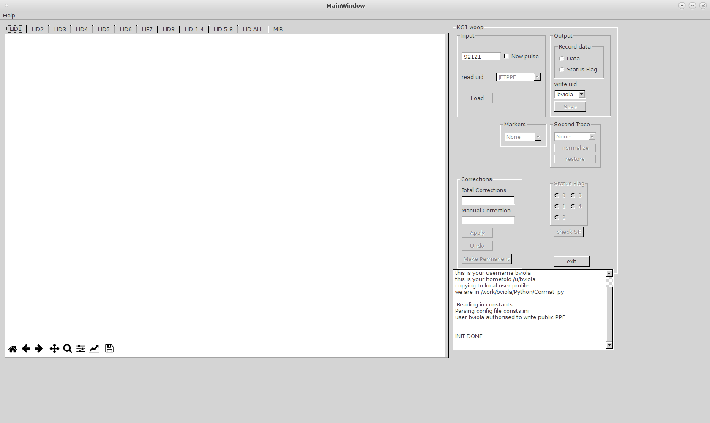

Tutorial
=========================================

In this section I will explain how to use the tool and what is possible to 
achieve.

Installation process
-------------------------------------------
To run and use the code the user must first install it and all its dependacies.

Running the code from Terminal
------------------------------------

To tun the code::
    cd /u/username/work/
    python Cormat_main.py -h
    
    usage: Cormat_main.py [-h] [-d DEBUG]

    Run Cormat_main

    optional arguments:
    -h, --help            show this help message and exit
    -d DEBUG, --debug DEBUG
    Debug level. 0: Info, 1: Warning, 2: Debug, 3: Error;
    default level is INFO

Alternatively is possible to run the code specifying the debug level to 
increase verbosity and show debug/warning/error messages.

By default the debug level is **INFO**

Once run an itialization process begins
and a database of all the pulses 
validated so far is created and the documentation is updated.

After the inialization process if finished the user will be prompted with the GUI:

    GUI Main Window

