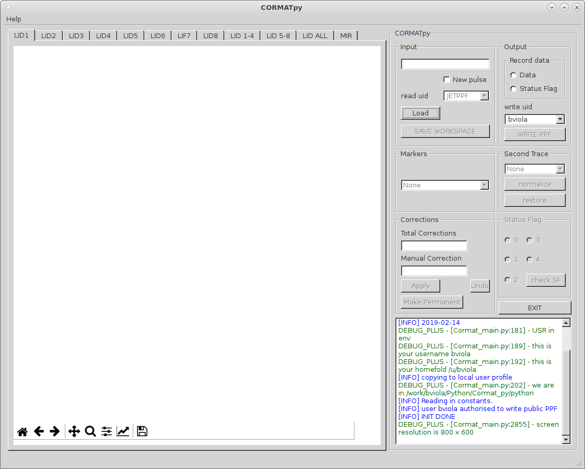
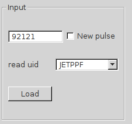

Tutorial
=========================================

In this section I will explain how to use the tool and what is possible to 
achieve.

Installation process
-------------------------------------------
To run and use the code the user must first install it and all its dependacies.

The code is stored in a git repository

from terminal

    >> git clone git@git.ccfe.ac.uk:bviola/Cormat_py.git -b master /your/folder

Running the code from Terminal
------------------------------------

To tun the code::
    cd /u/username/work/
    python Cormat_main.py -h
    
    usage: Cormat_main.py [-h] [-d DEBUG]

    Run Cormat_main

    optional arguments:
    -h, --help            show this help message and exit
    -d DEBUG, --debug DEBUG
    Debug level. 0: Info, 1: Warning, 2: Debug, 3: Error, 4: Debug plus;
    default level is INFO

Alternatively is possible to run the code specifying the debug level to 
increase verbosity and show debug/warning/error messages.

By default the debug level is **INFO**

Once run an itialization process begins:

    Initialisation process

The code will check if is running in an 64bit enviroment with Python3. It will also check what user is running the code and if it has proper authorisation to write KG1 public ppfs.
If not, the user will be able to run the code but he/she will be limited in writing only private ppfs.

If the user has chosen so, during the initialisation process also the documentation can be produced (updated).

After the inialization process, if finished successfully, the user will be prompted with the GUI:

    Main GUI

The user now will have to choose a pulse to validate

Using the code
------------------------------------

After chosing a pulse 

    Pulse selection

The user can use the drop down menu in Figure to choose the read_uid 
The list that is shown here contains all user that are authorised to write KG1 public ppf.
After clicking the load button, the code  start running according to:

    Load button logic

    Pulse selection

